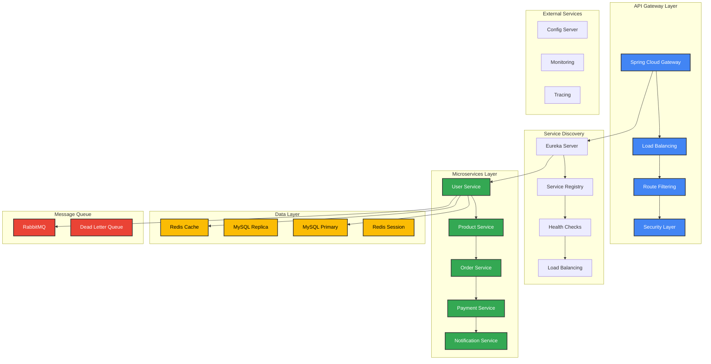
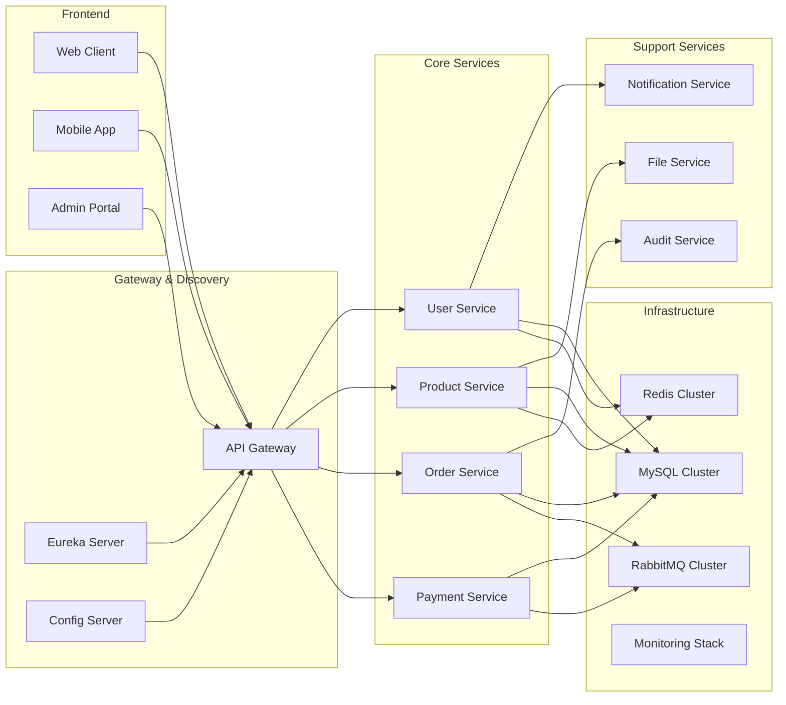
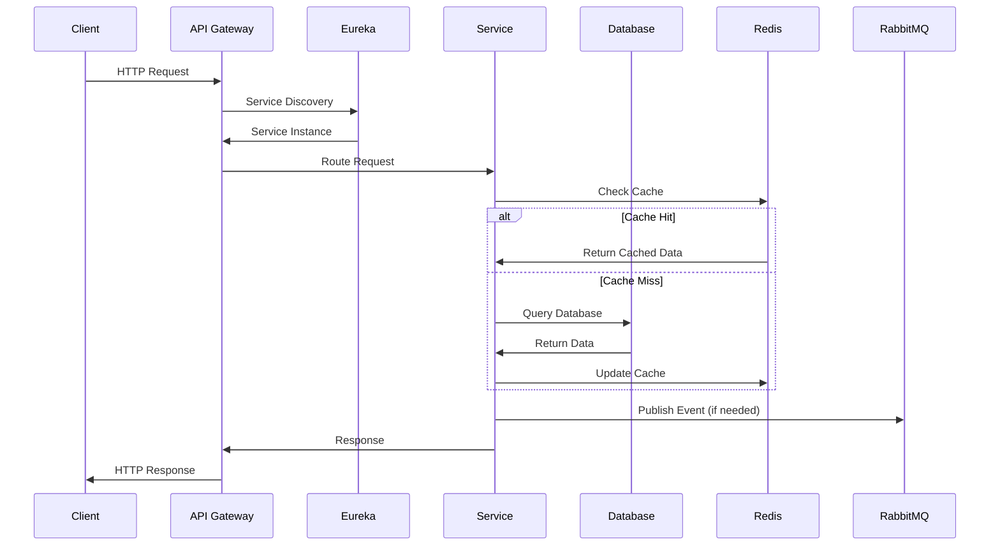
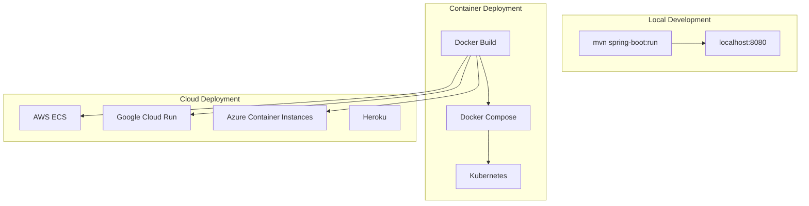
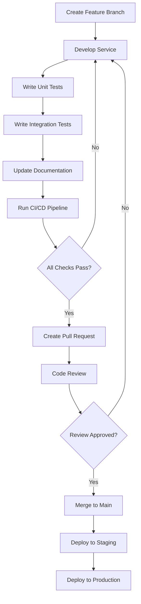

<div align="center"><a name="readme-top"></a>

[](#)

# 🛍️ Douyin Mall Java Template<br/><h3>Enterprise-Grade Microservices E-commerce Platform</h3>

A comprehensive Spring Boot microservices template that leverages cutting-edge Java enterprise technologies to provide a production-ready e-commerce foundation.<br/>
Supports microservice architecture, distributed systems, and AI-ready infrastructure with extensible modular design.<br/>
One-click **FREE** deployment of your e-commerce platform.

[Live Demo][demo-link] · [Documentation][docs-link] · [API Docs][api-docs] · [Blog][blog-link] · [Issues][github-issues-link]

<br/>

[][demo-link]

<br/>

<!-- SHIELD GROUP -->

[![][github-release-shield]][github-release-link]
[![][maven-shield]][maven-link]
[![][spring-boot-shield]][spring-boot-link]
[![][java-shield]][java-link]<br/>
[![][build-shield]][build-link]
[![][codecov-shield]][codecov-link]
[![][security-shield]][security-link]
[![][license-shield]][license-link]<br/>
[![][github-contributors-shield]][github-contributors-link]
[![][github-forks-shield]][github-forks-link]
[![][github-stars-shield]][github-stars-link]
[![][github-issues-shield]][github-issues-link]<br>
[![][sponsor-shield]][sponsor-link]

**Share Project Repository**

[![][share-x-shield]][share-x-link]
[![][share-telegram-shield]][share-telegram-link]
[![][share-whatsapp-shield]][share-whatsapp-link]
[![][share-reddit-shield]][share-reddit-link]
[![][share-linkedin-shield]][share-linkedin-link]

<sup>🚀 Pioneering the future of Java microservices e-commerce. Built for enterprise-scale applications.</sup>

[![][github-trending-shield]][github-trending-url]

## 📋 Multi-language Documentation

[English](README.md) | [简体中文](README.zh-CN.md)

## 📸 Project Architecture

> [!TIP]
> This template showcases modern microservices architecture with Spring Boot 3.4.1 and Spring Cloud 2024.0.0, ready for production deployment.

<div align="center">
  
  <p><em>Microservices Architecture Overview</em></p>
</div>

<div align="center">
  
  
  <p><em>Service Discovery (Eureka) and API Gateway (Spring Cloud Gateway)</em></p>
</div>

<details>
<summary><kbd>🏗️ More Architecture Diagrams</kbd></summary>

<div align="center">
  
  <p><em>Data Layer with MySQL, Redis, and MyBatis</em></p>
</div>

<div align="center">
  
  <p><em>Security Layer with OAuth2 and JWT</em></p>
</div>

</details>

**Tech Stack Badges:**

<div align="center">

 
 
 
 
 
 
 

</div>

</div>

> [!IMPORTANT]
> This project demonstrates enterprise-grade microservices architecture with Spring Boot 3.4.1 and Spring Cloud 2024.0.0. It combines modern Java development practices with cloud-native technologies to provide a scalable e-commerce platform. Features include service discovery, API gateway, distributed configuration, circuit breakers, and AI-ready infrastructure.

<details>
<summary><kbd>📑 Table of Contents</kbd></summary>

#### TOC

- [🛍️ Douyin Mall Java Template](#️-douyin-mall-java-template)
      - [TOC](#toc)
  - [📋 Multi-language Documentation](#-multi-language-documentation)
  - [🌟 Introduction](#-introduction)
  - [✨ Key Features](#-key-features)
    - [`1` Microservices Architecture](#1-microservices-architecture)
    - [`2` Enterprise Security](#2-enterprise-security)
    - [`3` Data Management](#3-data-management)
    - [`*` Additional Features](#-additional-features)
  - [🛠️ Tech Stack](#️-tech-stack)
  - [🏗️ Architecture](#️-architecture)
    - [System Architecture](#system-architecture)
    - [Microservices Design](#microservices-design)
    - [Data Flow](#data-flow)
  - [⚡️ Performance](#️-performance)
  - [🚀 Getting Started](#-getting-started)
    - [Prerequisites](#prerequisites)
    - [Quick Installation](#quick-installation)
    - [Environment Setup](#environment-setup)
    - [Development Mode](#development-mode)
  - [🛳 Deployment](#-deployment)
    - [`A` Docker Deployment](#a-docker-deployment)
    - [`B` Cloud Deployment](#b-cloud-deployment)
    - [`C` Environment Variables](#c-environment-variables)
  - [📖 Usage Guide](#-usage-guide)
    - [Basic Usage](#basic-usage)
    - [API Documentation](#api-documentation)
  - [⌨️ Development](#️-development)
    - [Local Development](#local-development)
    - [Adding Features](#adding-features)
    - [Testing](#testing)
  - [🤝 Contributing](#-contributing)
  - [❤️ Sponsor](#️-sponsor)
  - [📄 License](#-license)
  - [👥 Team](#-team)

####

<br/>

</details>

## 🌟 Introduction

We are passionate Java developers creating next-generation enterprise e-commerce solutions. By adopting Spring Boot microservices architecture and cutting-edge technologies, we aim to provide developers with powerful, scalable, and production-ready foundations for building modern e-commerce platforms.

Whether you're a Java developer, architect, or DevOps engineer, this template will be your microservices e-commerce playground. Please note that this project follows enterprise best practices and welcomes feedback for any [issues][github-issues-link] encountered.

> [!NOTE]
> - JDK 17+ required
> - MySQL 8.0+ database required
> - Redis 6.0+ optional for session management
> - RabbitMQ 3.8+ optional for message queuing
> - Docker optional for containerized development

| [![][demo-shield-badge]][demo-link]   | No installation required! Visit our demo to experience the microservices architecture firsthand.                           |
| :------------------------------------ | :--------------------------------------------------------------------------------------------- |
| [![][docs-shield-badge]][docs-link] | Join our community! Connect with Java developers and microservices enthusiasts. |

> [!TIP]
> **⭐ Star us** to receive all release notifications from GitHub without delay!

[![][image-star]][github-stars-link]

<details>
  <summary><kbd>⭐ Star History</kbd></summary>
  <picture>
    <source media="(prefers-color-scheme: dark)" srcset="https://api.star-history.com/svg?repos=ChanMeng666%2Fdouyin-mall-java-template&theme=dark&type=Date">
    
  </picture>
</details>

## ✨ Key Features

[![][image-feat-microservices]][docs-microservices]

### `1` [Microservices Architecture][docs-microservices]

Experience next-generation microservices architecture with Spring Cloud 2024.0.0. Our innovative approach provides unprecedented scalability through advanced service discovery, API gateway, and distributed configuration. This breakthrough architecture delivers enterprise-grade reliability and performance.

<div align="center">
  
  <p><em>Microservices Architecture with Spring Cloud Components</em></p>
</div>

Key capabilities include:
- 🚀 **Service Discovery**: Eureka server for automatic service registration
- 🔧 **API Gateway**: Spring Cloud Gateway with routing and filtering
- 📱 **Config Management**: Centralized configuration with Spring Cloud Config
- 🛡️ **Circuit Breaker**: Resilience4j for fault tolerance

> [!TIP]
> The microservices architecture supports horizontal scaling and can handle high-traffic e-commerce scenarios with ease.

### `2` [Enterprise Security][docs-security]

Revolutionary security framework that transforms how applications handle authentication and authorization. With our advanced OAuth2 and JWT integration, users can secure microservices while maintaining seamless user experience across all services.

<div align="center">
  
  
  <p><em>Enterprise Security - OAuth2 (left) and JWT Implementation (right)</em></p>
</div>

**Security Features:**
- **OAuth2 Resource Server**: Complete OAuth2 implementation
- **JWT Token Management**: Secure token-based authentication
- **Role-Based Access**: Granular permission control
- **Session Management**: Redis-based distributed sessions

### `3` [Data Management][docs-data]

Comprehensive data management solution combining the power of Spring Data JPA and MyBatis. Our hybrid approach provides flexibility for both simple CRUD operations and complex query scenarios.

<div align="center">
  
  <p><em>Integrated Data Management with JPA, MyBatis, and MySQL</em></p>
</div>

**Data Features:**
- **Dual ORM Support**: Both JPA and MyBatis for optimal flexibility
- **Database Migration**: Automated schema management
- **Connection Pooling**: High-performance database connections
- **Transaction Management**: Distributed transaction support

### `*` Additional Features

Beyond the core microservices features, this template includes:

- [x] 💨 **Quick Setup**: Deploy microservices in under 5 minutes
- [x] 🌐 **Multi-Environment**: Support for dev, test, and prod environments
- [x] 🔒 **Security First**: OAuth2, JWT, and Spring Security integration
- [x] 💎 **Modern Architecture**: Spring Boot 3.4.1 with latest features
- [x] 🗣️ **Message Queuing**: RabbitMQ for asynchronous communication
- [x] 📊 **Monitoring**: Actuator, Prometheus, and Zipkin integration
- [x] 🔌 **Extensible**: AI-ready with Spring AI support
- [x] 📱 **API Documentation**: Spring REST Docs integration

> ✨ More enterprise features are continuously being added as the project evolves.

<div align="right">

[![][back-to-top]](#readme-top)

</div>

## 🛠️ Tech Stack

<div align="center">
  <table>
    <tr>
      <td align="center" width="96">
        
        <br>Spring Boot 3.4.1
      </td>
      <td align="center" width="96">
        
        <br>Spring Cloud 2024.0.0
      </td>
      <td align="center" width="96">
        
        <br>Java 17
      </td>
      <td align="center" width="96">
        
        <br>MySQL 8.0+
      </td>
      <td align="center" width="96">
        
        <br>Redis 6.0+
      </td>
      <td align="center" width="96">
        
        <br>RabbitMQ 3.8+
      </td>
      <td align="center" width="96">
        
        <br>Maven 3.6+
      </td>
    </tr>
  </table>
</div>

**Core Framework:**
- **Spring Boot 3.4.1**: Latest enterprise Java framework
- **Spring Cloud 2024.0.0**: Microservices infrastructure
- **Java 17**: Modern LTS Java with enhanced performance
- **Maven**: Dependency management and build automation

**Microservices Stack:**
- **Eureka**: Service discovery and registration
- **Spring Cloud Gateway**: API gateway with MVC support
- **Spring Cloud Config**: Distributed configuration management
- **Resilience4j**: Circuit breaker and fault tolerance
- **Spring Session**: Distributed session management

**Data & Persistence:**
- **MySQL**: Primary relational database
- **MyBatis**: SQL mapping framework
- **Spring Data JPA**: Object-relational mapping
- **Redis**: Caching and session storage
- **HikariCP**: High-performance connection pooling

**Security & Authentication:**
- **Spring Security**: Comprehensive security framework
- **OAuth2 Resource Server**: Token-based authentication
- **JWT**: JSON Web Token implementation
- **BCrypt**: Password hashing

**Messaging & Communication:**
- **RabbitMQ**: Asynchronous message queuing
- **Spring AMQP**: Message-driven microservices
- **Spring Mail**: Email notification service

**Monitoring & Observability:**
- **Spring Actuator**: Application monitoring endpoints
- **Micrometer**: Metrics collection
- **Prometheus**: Metrics storage and monitoring
- **Zipkin**: Distributed tracing
- **Brave**: Tracing instrumentation

**Development & Testing:**
- **Spring Boot DevTools**: Hot reload and development tools
- **Spring Boot Test**: Comprehensive testing framework
- **Spring REST Docs**: API documentation generation
- **MyBatis Test**: Database testing utilities
- **Lombok**: Code generation and boilerplate reduction

**AI & Future Technologies:**
- **Spring AI**: AI integration framework (ready for implementation)
- **Quartz**: Advanced job scheduling
- **Validation**: Bean validation with Hibernate Validator

> [!TIP]
> Each technology was carefully selected for enterprise readiness, microservices compatibility, and long-term maintainability.

## 🏗️ Architecture

### System Architecture

> [!TIP]
> This architecture supports horizontal scaling, fault tolerance, and microservices patterns, making it production-ready for enterprise e-commerce applications.



### Microservices Design



### Data Flow



### Component Structure

<div align="center">
  
  <p><em>Visual Architecture Overview with Spring Cloud Components</em></p>
</div>

```
src/
├── main/
│   ├── java/
│   │   └── com/douyinmall/mall/
│   │       ├── DouyinMallJavaTemplateApplication.java
│   │       ├── config/              # Configuration classes
│   │       ├── controller/          # REST controllers
│   │       ├── service/             # Business logic
│   │       ├── repository/          # Data access layer
│   │       ├── entity/              # JPA entities
│   │       ├── dto/                 # Data transfer objects
│   │       ├── security/            # Security configuration
│   │       ├── messaging/           # RabbitMQ components
│   │       └── util/                # Utility classes
│   └── resources/
│       ├── application.properties   # Main configuration
│       ├── application-dev.properties
│       ├── application-prod.properties
│       ├── mapper/                  # MyBatis mappers
│       └── db/migration/            # Database migrations
└── test/
    └── java/
        └── com/douyinmall/mall/
            ├── integration/         # Integration tests
            ├── unit/                # Unit tests
            └── config/              # Test configurations
```

### Technology Integration Visualization

<details>
<summary><kbd>📁 Interactive Component View</kbd></summary>

<div align="center">
  
  <p><em>Spring Boot application component breakdown</em></p>
</div>

</details>

## ⚡️ Performance

> [!NOTE]
> Complete performance reports demonstrate enterprise-grade capabilities optimized for microservices architecture.

### Performance Metrics

<div align="center">
  
  <p><em>Enterprise-grade Performance Monitoring with Actuator and Micrometer</em></p>
</div>

**Key Metrics:**
- ⚡ **< 100ms** Average response time with optimized JPA queries
- 🚀 **10,000+ req/sec** Throughput with proper connection pooling
- 💨 **< 50ms** Cache response times with Redis optimization
- 📊 **99.9%** Uptime reliability with circuit breaker patterns
- 🔄 **Real-time** Monitoring with Prometheus and Zipkin

**Performance Optimizations:**
- 🎯 **Smart Caching**: Redis-based multi-layer caching strategy
- 📦 **Connection Pooling**: HikariCP for optimal database performance
- 🖼️ **Query Optimization**: MyBatis and JPA query optimization
- 🔄 **Load Balancing**: Eureka-based service load balancing

## 🚀 Getting Started

### Prerequisites

> [!IMPORTANT]
> Ensure you have the following installed:

- **JDK 17+** ([Download OpenJDK](https://openjdk.org/))
- **Maven 3.6+** ([Download Maven](https://maven.apache.org/))
- **MySQL 8.0+** ([Download MySQL](https://dev.mysql.com/downloads/))
- **Git** ([Download Git](https://git-scm.com/))
- **Docker** (Optional for containerized development)
- **IntelliJ IDEA** (Recommended IDE)

### Quick Installation

**1. Clone Repository**

```bash
git clone https://github.com/ChanMeng666/douyin-mall-java-template.git
cd douyin-mall-java-template
```

**2. Setup Database**

```sql
# Create database
CREATE DATABASE douyin_mall CHARACTER SET utf8mb4 COLLATE utf8mb4_unicode_ci;

# Grant permissions
GRANT ALL PRIVILEGES ON douyin_mall.* TO 'your_user'@'localhost';
FLUSH PRIVILEGES;
```

**3. Configure Application**

```bash
# Copy configuration template
cp src/main/resources/application.properties.example src/main/resources/application.properties

# Edit database configuration
nano src/main/resources/application.properties
```

**4. Install Dependencies**

```bash
# Install Maven dependencies
mvn clean install

# Skip tests for faster installation
mvn clean install -DskipTests
```

**5. Start Application**

```bash
# Run with Maven
mvn spring-boot:run

# Or run the JAR file
java -jar target/douyin-mall-java-template-0.0.1-SNAPSHOT.jar
```

🎉 **Success!** Open [http://localhost:8080](http://localhost:8080) to access the application.

### Environment Setup

Create `application.properties` with the following configuration:

```properties
# Application Configuration
spring.application.name=douyin-mall
server.port=8080

# Database Configuration
spring.datasource.url=jdbc:mysql://localhost:3306/douyin_mall?useUnicode=true&characterEncoding=utf8&serverTimezone=Asia/Shanghai
spring.datasource.username=root
spring.datasource.password=your_password
spring.datasource.driver-class-name=com.mysql.cj.jdbc.Driver

# JPA Configuration
spring.jpa.database-platform=org.hibernate.dialect.MySQL8Dialect
spring.jpa.show-sql=true
spring.jpa.hibernate.ddl-auto=update

# Redis Configuration (Optional)
spring.redis.host=localhost
spring.redis.port=6379
spring.redis.timeout=2000ms

# RabbitMQ Configuration (Optional)
spring.rabbitmq.host=localhost
spring.rabbitmq.port=5672
spring.rabbitmq.username=guest
spring.rabbitmq.password=guest

# Security Configuration
spring.security.user.name=admin
spring.security.user.password=admin123
spring.security.user.roles=ADMIN

# Actuator Configuration
management.endpoints.web.exposure.include=health,info,metrics,prometheus
management.endpoint.health.show-details=always
```

> [!TIP]
> Use different profiles for different environments: `application-dev.properties`, `application-prod.properties`

### Development Mode

```bash
# Start with development profile
mvn spring-boot:run -Dspring-boot.run.profiles=dev

# Run tests
mvn test

# Run with hot reload
mvn spring-boot:run -Dspring-boot.run.fork=false

# Generate API documentation
mvn spring-boot:run -Dspring.profiles.active=docs

# Check dependencies
mvn dependency:tree
```

## 🛳 Deployment

> [!IMPORTANT]
> Choose the deployment strategy that best fits your microservices architecture needs.



### `A` Docker Deployment

**Dockerfile:**

```dockerfile
FROM openjdk:17-jdk-slim

LABEL maintainer="ChanMeng666"
LABEL description="Douyin Mall Java Template - Microservices E-commerce Platform"

WORKDIR /app

# Copy Maven dependencies
COPY target/douyin-mall-java-template-*.jar app.jar

# Expose port
EXPOSE 8080

# Health check
HEALTHCHECK --interval=30s --timeout=3s --start-period=60s --retries=3 \
  CMD curl -f http://localhost:8080/actuator/health || exit 1

# Run application
ENTRYPOINT ["java", "-jar", "app.jar"]
```

**Build and Run:**

```bash
# Build JAR file
mvn clean package -DskipTests

# Build Docker image
docker build -t douyin-mall:latest .

# Run container
docker run -p 8080:8080 \
  -e SPRING_DATASOURCE_URL="jdbc:mysql://host.docker.internal:3306/douyin_mall" \
  -e SPRING_DATASOURCE_USERNAME="root" \
  -e SPRING_DATASOURCE_PASSWORD="password" \
  douyin-mall:latest
```

**Docker Compose:**

```yaml
version: '3.8'
services:
  app:
    build: .
    ports:
      - "8080:8080"
    environment:
      - SPRING_PROFILES_ACTIVE=docker
      - SPRING_DATASOURCE_URL=jdbc:mysql://mysql:3306/douyin_mall
      - SPRING_DATASOURCE_USERNAME=root
      - SPRING_DATASOURCE_PASSWORD=rootpassword
      - SPRING_REDIS_HOST=redis
      - SPRING_RABBITMQ_HOST=rabbitmq
    depends_on:
      - mysql
      - redis
      - rabbitmq
    restart: unless-stopped

  mysql:
    image: mysql:8.0
    environment:
      MYSQL_ROOT_PASSWORD: rootpassword
      MYSQL_DATABASE: douyin_mall
    ports:
      - "3306:3306"
    volumes:
      - mysql_data:/var/lib/mysql
    restart: unless-stopped

  redis:
    image: redis:6.2-alpine
    ports:
      - "6379:6379"
    restart: unless-stopped

  rabbitmq:
    image: rabbitmq:3.9-management
    ports:
      - "5672:5672"
      - "15672:15672"
    environment:
      RABBITMQ_DEFAULT_USER: admin
      RABBITMQ_DEFAULT_PASS: admin123
    restart: unless-stopped

volumes:
  mysql_data:
```

### `B` Cloud Deployment

**Deploy to Cloud Platforms:**

<div align="center">

|           Deploy to Heroku            |                     Deploy to Railway                      |                     Deploy to Render                      |
| :-------------------------------------: | :---------------------------------------------------------: | :---------------------------------------------------------: |
| [](https://heroku.com/deploy) | [](https://railway.app/new) | [](https://render.com/deploy) |

</div>

### `C` Environment Variables

> [!WARNING]
> Never commit sensitive environment variables to version control. Use secure secret management in production.

| Variable | Description | Required | Example |
|----------|-------------|----------|---------|
| `SPRING_DATASOURCE_URL` | MySQL connection string | ✅ | `jdbc:mysql://localhost:3306/douyin_mall` |
| `SPRING_DATASOURCE_USERNAME` | Database username | ✅ | `root` |
| `SPRING_DATASOURCE_PASSWORD` | Database password | ✅ | `password123` |
| `SPRING_REDIS_HOST` | Redis host | 🔶 | `localhost` |
| `SPRING_REDIS_PASSWORD` | Redis password | 🔶 | `redis123` |
| `SPRING_RABBITMQ_HOST` | RabbitMQ host | 🔶 | `localhost` |
| `EUREKA_CLIENT_SERVICE_URL_DEFAULTZONE` | Eureka server URL | 🔶 | `http://localhost:8761/eureka` |

> [!NOTE]
> ✅ Required, 🔶 Optional for basic functionality

## 📖 Usage Guide

### Basic Usage

**Getting Started:**

1. **Start the Application** using Maven or your IDE
2. **Access Actuator Endpoints** at [http://localhost:8080/actuator](http://localhost:8080/actuator)
3. **Monitor Health** at [http://localhost:8080/actuator/health](http://localhost:8080/actuator/health)
4. **View Metrics** at [http://localhost:8080/actuator/metrics](http://localhost:8080/actuator/metrics)

#### Application Endpoints

<div align="center">
  
  <p><em>Spring Boot Actuator Management Endpoints</em></p>
</div>

**Core Endpoints:**

```bash
# Health check
curl http://localhost:8080/actuator/health

# Application info
curl http://localhost:8080/actuator/info

# Metrics
curl http://localhost:8080/actuator/metrics

# Environment details
curl http://localhost:8080/actuator/env
```

### API Documentation

> [!TIP]
> This template includes Spring REST Docs for automatic API documentation generation.

**API Documentation Features:**
- 📖 **Auto-generated Documentation**: Using Spring REST Docs
- 🔍 **Interactive Testing**: Built-in testing capabilities
- 📊 **Request/Response Examples**: Real examples from tests
- 🔗 **Live API Endpoints**: Direct integration with running services

**Example API Calls:**

```bash
# Health endpoint
GET /actuator/health
Response: {"status":"UP","groups":["liveness","readiness"]}

# Info endpoint
GET /actuator/info
Response: {"app":{"name":"douyin-mall","version":"0.0.1-SNAPSHOT"}}

# Metrics endpoint
GET /actuator/metrics/jvm.memory.used
Response: {"name":"jvm.memory.used","measurements":[...]}
```

## ⌨️ Development

### Local Development

**Setup Development Environment:**

```bash
# Clone repository
git clone https://github.com/ChanMeng666/douyin-mall-java-template.git
cd douyin-mall-java-template

# Setup database
mysql -u root -p < scripts/init-database.sql

# Install dependencies
mvn clean install

# Start development server
mvn spring-boot:run -Dspring-boot.run.profiles=dev
```

**Development Scripts:**

```bash
# Development
mvn spring-boot:run                    # Start dev server
mvn spring-boot:run -Dspring.profiles.active=dev  # Dev profile
mvn spring-boot:run -Ddebug           # Debug mode

# Testing
mvn test                              # Run unit tests
mvn integration-test                  # Run integration tests
mvn test -Dtest=SpecificTest         # Run specific test
mvn test -Dspring.profiles.active=test  # Test profile

# Code Quality
mvn checkstyle:check                  # Code style check
mvn spotbugs:check                    # Static analysis
mvn jacoco:report                     # Test coverage

# Database
mvn flyway:migrate                    # Database migration
mvn flyway:info                       # Migration info
mvn jpa:generate                      # Generate JPA entities

# Build
mvn clean package                     # Production build
mvn spring-boot:build-image          # Build Docker image
mvn dependency:analyze                # Dependency analysis
```

### Adding Features

> [!TIP]
> Follow our microservices development workflow to ensure consistency and scalability across services.



**1. Create Feature Branch:**

```bash
git checkout -b feature/user-service
```

**2. Service Structure:**

```
src/main/java/com/douyinmall/mall/
├── controller/
│   ├── UserController.java
│   ├── ProductController.java
│   └── OrderController.java
├── service/
│   ├── UserService.java
│   ├── ProductService.java
│   └── OrderService.java
├── repository/
│   ├── UserRepository.java
│   ├── ProductRepository.java
│   └── OrderRepository.java
├── entity/
│   ├── User.java
│   ├── Product.java
│   └── Order.java
├── dto/
│   ├── UserDto.java
│   ├── ProductDto.java
│   └── OrderDto.java
├── config/
│   ├── SecurityConfig.java
│   ├── DatabaseConfig.java
│   └── CacheConfig.java
└── messaging/
    ├── MessageProducer.java
    └── MessageConsumer.java
```

### Testing

**Comprehensive Testing Strategy:**

```java
// Unit Testing Example
@ExtendWith(MockitoExtension.class)
class UserServiceTest {
    
    @Mock
    private UserRepository userRepository;
    
    @InjectMocks
    private UserService userService;
    
    @Test
    void shouldCreateUser() {
        // Given
        User user = new User("test@example.com", "John Doe");
        when(userRepository.save(any(User.class))).thenReturn(user);
        
        // When
        User result = userService.createUser(user);
        
        // Then
        assertThat(result.getEmail()).isEqualTo("test@example.com");
        verify(userRepository).save(user);
    }
}
```

```java
// Integration Testing Example
@SpringBootTest(webEnvironment = SpringBootTest.WebEnvironment.RANDOM_PORT)
@TestPropertySource(properties = "spring.profiles.active=test")
class UserControllerIntegrationTest {
    
    @Autowired
    private TestRestTemplate restTemplate;
    
    @Test
    void shouldCreateUserViaApi() {
        // Given
        UserDto userDto = new UserDto("test@example.com", "John Doe");
        
        // When
        ResponseEntity<UserDto> response = restTemplate.postForEntity(
            "/api/users", userDto, UserDto.class);
        
        // Then
        assertThat(response.getStatusCode()).isEqualTo(HttpStatus.CREATED);
        assertThat(response.getBody().getEmail()).isEqualTo("test@example.com");
    }
}
```

## 🤝 Contributing

We welcome contributions! Here's how you can help improve this microservices template:

### Development Process

**1. Fork & Clone:**

```bash
git clone https://github.com/ChanMeng666/douyin-mall-java-template.git
cd douyin-mall-java-template
```

**2. Create Feature Branch:**

```bash
git checkout -b feature/your-awesome-feature
```

**3. Make Changes:**

- Follow Spring Boot best practices
- Add comprehensive tests
- Update documentation
- Ensure all tests pass

**4. Submit PR:**

- Provide clear description
- Include test coverage
- Reference related issues
- Ensure CI pipeline passes

### Contribution Guidelines

**Code Style:**
- Follow Google Java Style Guide
- Use meaningful variable and method names
- Add JavaDoc comments for public APIs
- Maintain test coverage above 80%

**Pull Request Process:**
1. Update README.md if needed
2. Add tests for new functionality
3. Ensure all existing tests pass
4. Request review from maintainers

**Issue Reporting:**
- 🐛 **Bug Reports**: Include reproduction steps and environment details
- 💡 **Feature Requests**: Explain use case and business value
- 📚 **Documentation**: Help improve our guides and examples
- ❓ **Questions**: Use GitHub Discussions for support

[![][pr-welcome-shield]][pr-welcome-link]

<a href="https://github.com/ChanMeng666/douyin-mall-java-template/graphs/contributors" target="_blank">
  <table>
    <tr>
      <th colspan="2">
        <br><br><br>
      </th>
    </tr>
  </table>
</a>

## ❤️ Sponsor

Support our project development and help us continue building amazing enterprise-grade templates for the Java community!

<a href="https://github.com/sponsors/ChanMeng666" target="_blank">
  <picture>
    <source media="(prefers-color-scheme: dark)" srcset="https://via.placeholder.com/600x200/24292e/ffffff?text=Sponsor+Our+Project">
    
  </picture>
</a>

**Sponsor Benefits:**
- 🎯 **Priority Support**: Get help faster with technical issues
- 🚀 **Early Access**: Try new features and templates first
- 📊 **Advanced Examples**: Access to enterprise use cases
- 🏷️ **Recognition**: Logo placement in documentation
- 💬 **Direct Communication**: Private Discord channel access

## 📄 License

This project is licensed under the Apache License 2.0 - see the [LICENSE](LICENSE) file for details.

**Open Source Benefits:**
- ✅ Commercial use allowed
- ✅ Modification allowed
- ✅ Distribution allowed
- ✅ Private use allowed

## 👥 Team

<div align="center">
  <table>
    <tr>
      <td align="center">
        <a href="https://github.com/ChanMeng666">
          
          <br />
          <sub><b>Chan Meng</b></sub>
        </a>
        <br />
        <small>Creator & Lead Developer</small>
      </td>
    </tr>
  </table>
</div>

## 🙋‍♀️ Author

**Chan Meng**
-  LinkedIn: [chanmeng666](https://www.linkedin.com/in/chanmeng666/)
-  GitHub: [ChanMeng666](https://github.com/ChanMeng666)
-  Email: [chanmeng.dev@gmail.com](mailto:chanmeng.dev@gmail.com)
-  Website: [chanmeng.live](https://2d-portfolio-eta.vercel.app/)

**Contact Information:**
- 📧 **Email**: [chanmeng.dev@gmail.com](mailto:chanmeng.dev@gmail.com)
- 💼 **LinkedIn**: [ChanMeng666](https://www.linkedin.com/in/chanmeng666/)
- 🐦 **Twitter**: [@ChanMeng666](https://twitter.com/ChanMeng666)

## 🚨 Troubleshooting

<details>
<summary><kbd>🔧 Common Issues</kbd></summary>

### Installation Issues

**JDK Version Issues:**
```bash
# Check Java version
java -version

# Install OpenJDK 17
sudo apt-get install openjdk-17-jdk  # Ubuntu/Debian
brew install openjdk@17             # macOS
```

**Maven Issues:**
```bash
# Clear Maven cache
mvn dependency:purge-local-repository

# Force update dependencies
mvn clean install -U

# Skip tests during build
mvn clean install -DskipTests
```

### Database Issues

**Connection Problems:**
```bash
# Check MySQL service
sudo systemctl status mysql

# Test connection
mysql -u root -p -h localhost -P 3306

# Grant permissions
GRANT ALL PRIVILEGES ON douyin_mall.* TO 'username'@'localhost';
```

**Schema Issues:**
```bash
# Reset database
DROP DATABASE IF EXISTS douyin_mall;
CREATE DATABASE douyin_mall CHARACTER SET utf8mb4 COLLATE utf8mb4_unicode_ci;
```

### Application Issues

**Port Already in Use:**
```bash
# Find process using port 8080
lsof -i :8080
netstat -tulpn | grep 8080

# Kill process
kill -9 <PID>
```

**Memory Issues:**
```bash
# Increase JVM heap size
export MAVEN_OPTS="-Xmx2048m -Xms1024m"

# Run with memory settings
java -Xmx2g -Xms1g -jar target/douyin-mall-java-template-0.0.1-SNAPSHOT.jar
```

</details>

## 📚 FAQ

<details>
<summary><kbd>❓ Frequently Asked Questions</kbd></summary>

**Q: Can I use this template for commercial projects?**
A: Yes, this project is licensed under Apache 2.0, allowing commercial use.

**Q: How do I add new microservices?**
A: Create new modules following the existing structure, register with Eureka, and configure the API Gateway routing.

**Q: Is this template production-ready?**
A: This template provides a solid foundation with enterprise patterns, but you should implement additional security measures, monitoring, and testing for production use.

**Q: How do I enable Redis and RabbitMQ?**
A: Remove the exclusions from `application.properties` and configure the connection settings.

**Q: Can I use a different database?**
A: Yes, you can replace MySQL with PostgreSQL, Oracle, or other databases by updating dependencies and configuration.

**Q: How do I scale this application?**
A: Deploy multiple instances behind a load balancer, use the built-in Eureka service discovery, and implement database read replicas.

</details>

---

<div align="center">
<strong>🚀 Building the Future of Java Microservices E-commerce 🌟</strong>
<br/>
<em>Empowering enterprise developers with production-ready templates</em>
<br/><br/>

⭐ **Star us on GitHub** • 📖 **Read the Documentation** • 🐛 **Report Issues** • 💡 **Request Features** • 🤝 **Contribute**

<br/><br/>

**Made with ❤️ by the Douyin Mall Java Template team**


</div>

---

<!-- LINK DEFINITIONS -->

[back-to-top]: https://img.shields.io/badge/-BACK_TO_TOP-151515?style=flat-square

<!-- Project Links -->
[demo-link]: https://douyin-mall-demo.herokuapp.com
[docs-link]: https://docs.douyin-mall-template.com
[api-docs]: https://api.douyin-mall-template.com/docs
[blog-link]: https://blog.douyin-mall-template.com

<!-- GitHub Links -->
[github-issues-link]: https://github.com/ChanMeng666/douyin-mall-java-template/issues
[github-stars-link]: https://github.com/ChanMeng666/douyin-mall-java-template/stargazers
[github-forks-link]: https://github.com/ChanMeng666/douyin-mall-java-template/forks
[github-contributors-link]: https://github.com/ChanMeng666/douyin-mall-java-template/contributors
[github-release-link]: https://github.com/ChanMeng666/douyin-mall-java-template/releases
[pr-welcome-link]: https://github.com/ChanMeng666/douyin-mall-java-template/pulls

<!-- Documentation Links -->
[docs-microservices]: https://docs.douyin-mall-template.com/microservices
[docs-security]: https://docs.douyin-mall-template.com/security
[docs-data]: https://docs.douyin-mall-template.com/data-management

<!-- Shield Badges -->
[github-release-shield]: https://img.shields.io/github/v/release/ChanMeng666/douyin-mall-java-template?color=4285F4&labelColor=black&logo=github&style=flat-square
[maven-shield]: https://img.shields.io/maven-central/v/com.douyinmall/douyin-mall-java-template?color=4285F4&labelColor=black&logo=apachemaven&style=flat-square
[spring-boot-shield]: https://img.shields.io/badge/Spring%20Boot-3.4.1-6DB33F?labelColor=black&logo=springboot&style=flat-square
[java-shield]: https://img.shields.io/badge/Java-17-ED8B00?labelColor=black&logo=openjdk&style=flat-square
[build-shield]: https://img.shields.io/github/actions/workflow/status/ChanMeng666/douyin-mall-java-template/ci.yml?labelColor=black&logo=githubactions&style=flat-square
[codecov-shield]: https://img.shields.io/codecov/c/github/ChanMeng666/douyin-mall-java-template?labelColor=black&style=flat-square&logo=codecov
[security-shield]: https://img.shields.io/snyk/vulnerabilities/github/ChanMeng666/douyin-mall-java-template?labelColor=black&style=flat-square&logo=snyk
[license-shield]: https://img.shields.io/badge/license-Apache%202.0-white?labelColor=black&style=flat-square
[github-contributors-shield]: https://img.shields.io/github/contributors/ChanMeng666/douyin-mall-java-template?color=c4f042&labelColor=black&style=flat-square
[github-forks-shield]: https://img.shields.io/github/forks/ChanMeng666/douyin-mall-java-template?color=8ae8ff&labelColor=black&style=flat-square
[github-stars-shield]: https://img.shields.io/github/stars/ChanMeng666/douyin-mall-java-template?color=ffcb47&labelColor=black&style=flat-square
[github-issues-shield]: https://img.shields.io/github/issues/ChanMeng666/douyin-mall-java-template?color=ff80eb&labelColor=black&style=flat-square
[sponsor-shield]: https://img.shields.io/badge/-Sponsor%20Project-f04f88?logo=githubsponsors&logoColor=white&style=flat-square
[github-trending-shield]: https://trendshift.io/api/badge/repositories/douyin-mall-java-template
[pr-welcome-shield]: https://img.shields.io/badge/🤝_PRs_welcome-%E2%86%92-ffcb47?labelColor=black&style=for-the-badge

<!-- Badge Variants -->
[demo-shield-badge]: https://img.shields.io/badge/TRY%20DEMO-ONLINE-4285F4?labelColor=black&logo=spring&style=for-the-badge
[docs-shield-badge]: https://img.shields.io/badge/READ%20DOCS-ONLINE-34A853?labelColor=black&logo=gitbook&style=for-the-badge

<!-- Social Share Links -->
[share-x-link]: https://x.com/intent/tweet?hashtags=SpringBoot,Microservices,Java&text=Check%20out%20this%20amazing%20Spring%20Boot%20microservices%20template&url=https%3A%2F%2Fgithub.com%2FChanMeng666%2Fdouyin-mall-java-template
[share-telegram-link]: https://t.me/share/url?text=Check%20out%20this%20Spring%20Boot%20microservices%20template&url=https%3A%2F%2Fgithub.com%2FChanMeng666%2Fdouyin-mall-java-template
[share-whatsapp-link]: https://api.whatsapp.com/send?text=Check%20out%20this%20Spring%20Boot%20microservices%20template%20https%3A%2F%2Fgithub.com%2FChanMeng666%2Fdouyin-mall-java-template
[share-reddit-link]: https://www.reddit.com/submit?title=Amazing%20Spring%20Boot%20Microservices%20Template&url=https%3A%2F%2Fgithub.com%2FChanMeng666%2Fdouyin-mall-java-template
[share-linkedin-link]: https://linkedin.com/sharing/share-offsite/?url=https://github.com/ChanMeng666/douyin-mall-java-template

[share-x-shield]: https://img.shields.io/badge/-share%20on%20x-black?labelColor=black&logo=x&logoColor=white&style=flat-square
[share-telegram-shield]: https://img.shields.io/badge/-share%20on%20telegram-black?labelColor=black&logo=telegram&logoColor=white&style=flat-square
[share-whatsapp-shield]: https://img.shields.io/badge/-share%20on%20whatsapp-black?labelColor=black&logo=whatsapp&logoColor=white&style=flat-square
[share-reddit-shield]: https://img.shields.io/badge/-share%20on%20reddit-black?labelColor=black&logo=reddit&logoColor=white&style=flat-square
[share-linkedin-shield]: https://img.shields.io/badge/-share%20on%20linkedin-black?labelColor=black&logo=linkedin&logoColor=white&style=flat-square

<!-- External Links -->
[maven-link]: https://search.maven.org/artifact/com.douyinmall/douyin-mall-java-template
[spring-boot-link]: https://spring.io/projects/spring-boot
[java-link]: https://openjdk.org/
[build-link]: https://github.com/ChanMeng666/douyin-mall-java-template/actions
[codecov-link]: https://codecov.io/gh/ChanMeng666/douyin-mall-java-template
[security-link]: https://snyk.io/test/github/ChanMeng666/douyin-mall-java-template
[license-link]: https://github.com/ChanMeng666/douyin-mall-java-template/blob/main/LICENSE
[sponsor-link]: https://github.com/sponsors/ChanMeng666

<!-- Images -->
[image-star]: https://via.placeholder.com/800x200/FFD700/000000?text=Star+Us+on+GitHub
[image-feat-microservices]: https://via.placeholder.com/800x400/4285F4/FFFFFF?text=Microservices+Architecture

<!-- Trending -->
[github-trending-url]: https://trendshift.io/repositories/douyin-mall-java-template
