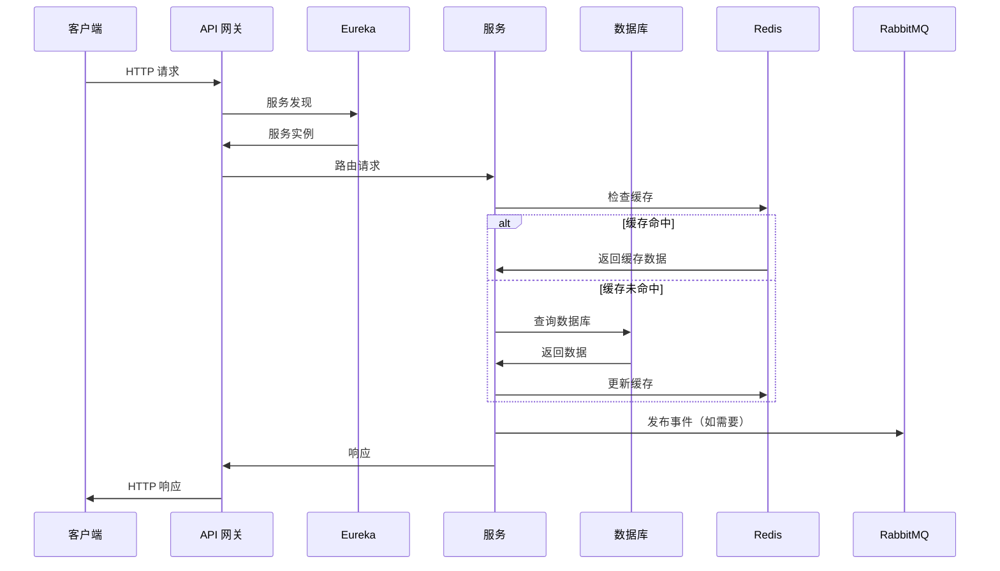
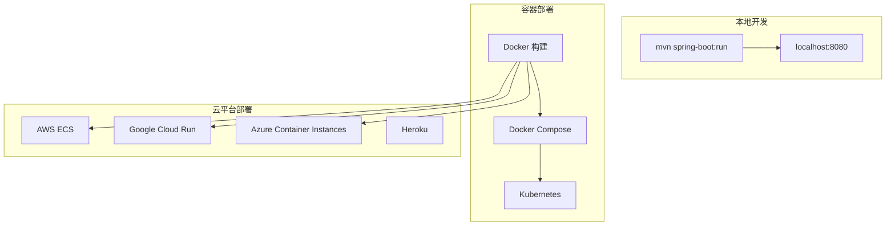
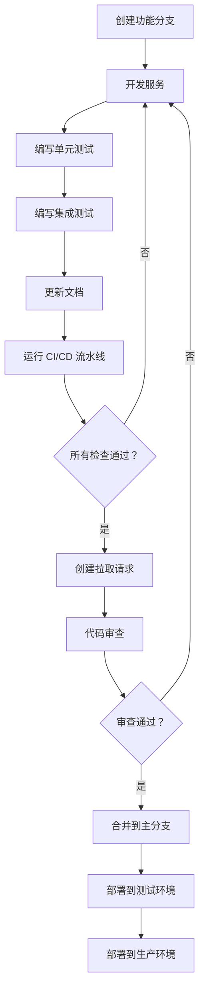

<div align="center"><a name="readme-top"></a>

[](#)

# 🛍️ 抖音商城 Java 模板<br/><h3>企业级微服务电商平台</h3>

一个全面的 Spring Boot 微服务模板，利用前沿的 Java 企业技术提供生产就绪的电商基础架构。<br/>
支持微服务架构、分布式系统和 AI 就绪基础设施，具有可扩展的模块化设计。<br/>
一键**免费**部署您的电商平台。

[在线演示][demo-link] · [文档][docs-link] · [API 文档][api-docs] · [博客][blog-link] · [问题反馈][github-issues-link]

<br/>

[][demo-link]

<br/>

<!-- 徽章组 -->

[![][github-release-shield]][github-release-link]
[![][maven-shield]][maven-link]
[![][spring-boot-shield]][spring-boot-link]
[![][java-shield]][java-link]<br/>
[![][build-shield]][build-link]
[![][codecov-shield]][codecov-link]
[![][security-shield]][security-link]
[![][license-shield]][license-link]<br/>
[![][github-contributors-shield]][github-contributors-link]
[![][github-forks-shield]][github-forks-link]
[![][github-stars-shield]][github-stars-link]
[![][github-issues-shield]][github-issues-link]<br>
[![][sponsor-shield]][sponsor-link]

**分享项目仓库**

[![][share-x-shield]][share-x-link]
[![][share-telegram-shield]][share-telegram-link]
[![][share-whatsapp-shield]][share-whatsapp-link]
[![][share-reddit-shield]][share-reddit-link]
[![][share-linkedin-shield]][share-linkedin-link]

<sup>🚀 引领 Java 微服务电商的未来。为企业级应用而构建。</sup>

[![][github-trending-shield]][github-trending-url]

## 📋 多语言文档

[English](README.md) | [简体中文](README.zh-CN.md)

## 📸 项目架构

> [!TIP]
> 该模板展示了现代微服务架构，采用 Spring Boot 3.4.1 和 Spring Cloud 2024.0.0，适用于生产部署。

<div align="center">
  
  <p><em>微服务架构概览</em></p>
</div>

<div align="center">
  
  
  <p><em>服务发现（Eureka）和 API 网关（Spring Cloud Gateway）</em></p>
</div>

<details>
<summary><kbd>🏗️ 更多架构图</kbd></summary>

<div align="center">
  
  <p><em>数据层（MySQL、Redis 和 MyBatis）</em></p>
</div>

<div align="center">
  
  <p><em>安全层（OAuth2 和 JWT）</em></p>
</div>

</details>

**技术栈徽章：**

<div align="center">

 
 
 
 
 
 
 

</div>

</div>

> [!IMPORTANT]
> 该项目展示了使用 Spring Boot 3.4.1 和 Spring Cloud 2024.0.0 的企业级微服务架构。它结合了现代 Java 开发实践与云原生技术，提供可扩展的电商平台。功能包括服务发现、API 网关、分布式配置、熔断器和 AI 就绪基础设施。

<details>
<summary><kbd>📑 目录</kbd></summary>

#### 目录

- [🛍️ 抖音商城 Java 模板](#️-抖音商城-java-模板)
      - [目录](#目录)
  - [📋 多语言文档](#-多语言文档)
  - [📸 项目架构](#-项目架构)
  - [🌟 项目介绍](#-项目介绍)
  - [✨ 核心特性](#-核心特性)
    - [`1` 微服务架构](#1-微服务架构)
    - [`2` 企业级安全](#2-企业级安全)
    - [`3` 数据管理](#3-数据管理)
    - [`*` 其他特性](#-其他特性)
  - [🛠️ 技术栈](#️-技术栈)
  - [🏗️ 架构设计](#️-架构设计)
    - [系统架构](#系统架构)
    - [微服务设计](#微服务设计)
    - [数据流](#数据流)
  - [⚡️ 性能表现](#️-性能表现)
  - [🚀 快速开始](#-快速开始)
    - [环境要求](#环境要求)
    - [快速安装](#快速安装)
    - [环境配置](#环境配置)
    - [开发模式](#开发模式)
  - [🛳 部署指南](#-部署指南)
    - [`A` Docker 部署](#a-docker-部署)
    - [`B` 云平台部署](#b-云平台部署)
    - [`C` 环境变量](#c-环境变量)
  - [📖 使用指南](#-使用指南)
    - [基本使用](#基本使用)
    - [API 文档](#api-文档)
  - [⌨️ 开发指南](#️-开发指南)
    - [本地开发](#本地开发)
    - [添加新功能](#添加新功能)
    - [测试](#测试)
  - [🤝 贡献指南](#-贡献指南)
  - [❤️ 赞助](#️-赞助)
  - [📄 许可证](#-许可证)
  - [👥 团队](#-团队)

####

<br/>

</details>

## 🌟 项目介绍

我们是一群充满激情的 Java 开发者，致力于创建下一代企业级电商解决方案。通过采用 Spring Boot 微服务架构和前沿技术，我们旨在为开发者提供强大、可扩展且生产就绪的现代电商平台基础。

无论您是 Java 开发者、架构师还是 DevOps 工程师，这个模板都将成为您的微服务电商游乐场。请注意，该项目遵循企业最佳实践，欢迎对遇到的任何[问题][github-issues-link]提供反馈。

> [!NOTE]
> - 需要 JDK 17+
> - 需要 MySQL 8.0+ 数据库
> - Redis 6.0+ 可选，用于会话管理
> - RabbitMQ 3.8+ 可选，用于消息队列
> - Docker 可选，用于容器化开发

| [![][demo-shield-badge]][demo-link]   | 无需安装！访问我们的演示，亲身体验微服务架构。                           |
| :------------------------------------ | :--------------------------------------------------------------------------------------------- |
| [![][docs-shield-badge]][docs-link] | 加入我们的社区！与 Java 开发者和微服务爱好者建立联系。 |

> [!TIP]
> **⭐ 给我们点星** 立即从 GitHub 接收所有发布通知！

[![][image-star]][github-stars-link]

<details>
  <summary><kbd>⭐ Star 历史</kbd></summary>
  <picture>
    <source media="(prefers-color-scheme: dark)" srcset="https://api.star-history.com/svg?repos=ChanMeng666%2Fdouyin-mall-java-template&theme=dark&type=Date">
    
  </picture>
</details>

<!-- 链接定义 -->

[back-to-top]: https://img.shields.io/badge/-返回顶部-151515?style=flat-square

<!-- 项目链接 -->
[demo-link]: https://douyin-mall-demo.herokuapp.com
[docs-link]: https://docs.douyin-mall-template.com
[api-docs]: https://api.douyin-mall-template.com/docs
[blog-link]: https://blog.douyin-mall-template.com

<!-- GitHub 链接 -->
[github-issues-link]: https://github.com/ChanMeng666/douyin-mall-java-template/issues
[github-stars-link]: https://github.com/ChanMeng666/douyin-mall-java-template/stargazers
[github-forks-link]: https://github.com/ChanMeng666/douyin-mall-java-template/forks
[github-contributors-link]: https://github.com/ChanMeng666/douyin-mall-java-template/contributors
[github-release-link]: https://github.com/ChanMeng666/douyin-mall-java-template/releases
[pr-welcome-link]: https://github.com/ChanMeng666/douyin-mall-java-template/pulls

<!-- 文档链接 -->
[docs-microservices]: https://docs.douyin-mall-template.com/microservices
[docs-security]: https://docs.douyin-mall-template.com/security
[docs-data]: https://docs.douyin-mall-template.com/data-management

<!-- 徽章 -->
[github-release-shield]: https://img.shields.io/github/v/release/ChanMeng666/douyin-mall-java-template?color=4285F4&labelColor=black&logo=github&style=flat-square
[maven-shield]: https://img.shields.io/maven-central/v/com.douyinmall/douyin-mall-java-template?color=4285F4&labelColor=black&logo=apachemaven&style=flat-square
[spring-boot-shield]: https://img.shields.io/badge/Spring%20Boot-3.4.1-6DB33F?labelColor=black&logo=springboot&style=flat-square
[java-shield]: https://img.shields.io/badge/Java-17-ED8B00?labelColor=black&logo=openjdk&style=flat-square
[build-shield]: https://img.shields.io/github/actions/workflow/status/ChanMeng666/douyin-mall-java-template/ci.yml?labelColor=black&logo=githubactions&style=flat-square
[codecov-shield]: https://img.shields.io/codecov/c/github/ChanMeng666/douyin-mall-java-template?labelColor=black&style=flat-square&logo=codecov
[security-shield]: https://img.shields.io/snyk/vulnerabilities/github/ChanMeng666/douyin-mall-java-template?labelColor=black&style=flat-square&logo=snyk
[license-shield]: https://img.shields.io/badge/license-Apache%202.0-white?labelColor=black&style=flat-square
[github-contributors-shield]: https://img.shields.io/github/contributors/ChanMeng666/douyin-mall-java-template?color=c4f042&labelColor=black&style=flat-square
[github-forks-shield]: https://img.shields.io/github/forks/ChanMeng666/douyin-mall-java-template?color=8ae8ff&labelColor=black&style=flat-square
[github-stars-shield]: https://img.shields.io/github/stars/ChanMeng666/douyin-mall-java-template?color=ffcb47&labelColor=black&style=flat-square
[github-issues-shield]: https://img.shields.io/github/issues/ChanMeng666/douyin-mall-java-template?color=ff80eb&labelColor=black&style=flat-square
[sponsor-shield]: https://img.shields.io/badge/-赞助项目-f04f88?logo=githubsponsors&logoColor=white&style=flat-square
[github-trending-shield]: https://trendshift.io/api/badge/repositories/douyin-mall-java-template
[pr-welcome-shield]: https://img.shields.io/badge/🤝_欢迎_PR-%E2%86%92-ffcb47?labelColor=black&style=for-the-badge

<!-- 徽章变体 -->
[demo-shield-badge]: https://img.shields.io/badge/体验演示-在线-4285F4?labelColor=black&logo=spring&style=for-the-badge
[docs-shield-badge]: https://img.shields.io/badge/阅读文档-在线-34A853?labelColor=black&logo=gitbook&style=for-the-badge

<!-- 社交分享链接 -->
[share-x-link]: https://x.com/intent/tweet?hashtags=SpringBoot,Microservices,Java&text=看看这个惊人的Spring%20Boot微服务模板&url=https%3A%2F%2Fgithub.com%2FChanMeng666%2Fdouyin-mall-java-template
[share-telegram-link]: https://t.me/share/url?text=看看这个Spring%20Boot微服务模板&url=https%3A%2F%2Fgithub.com%2FChanMeng666%2Fdouyin-mall-java-template
[share-whatsapp-link]: https://api.whatsapp.com/send?text=看看这个Spring%20Boot微服务模板%20https%3A%2F%2Fgithub.com%2FChanMeng666%2Fdouyin-mall-java-template
[share-reddit-link]: https://www.reddit.com/submit?title=惊人的Spring%20Boot微服务模板&url=https%3A%2F%2Fgithub.com%2FChanMeng666%2Fdouyin-mall-java-template
[share-linkedin-link]: https://linkedin.com/sharing/share-offsite/?url=https://github.com/ChanMeng666/douyin-mall-java-template

[share-x-shield]: https://img.shields.io/badge/-在%20x%20分享-black?labelColor=black&logo=x&logoColor=white&style=flat-square
[share-telegram-shield]: https://img.shields.io/badge/-在%20telegram%20分享-black?labelColor=black&logo=telegram&logoColor=white&style=flat-square
[share-whatsapp-shield]: https://img.shields.io/badge/-在%20whatsapp%20分享-black?labelColor=black&logo=whatsapp&logoColor=white&style=flat-square
[share-reddit-shield]: https://img.shields.io/badge/-在%20reddit%20分享-black?labelColor=black&logo=reddit&logoColor=white&style=flat-square
[share-linkedin-shield]: https://img.shields.io/badge/-在%20linkedin%20分享-black?labelColor=black&logo=linkedin&logoColor=white&style=flat-square

<!-- 外部链接 -->
[maven-link]: https://search.maven.org/artifact/com.douyinmall/douyin-mall-java-template
[spring-boot-link]: https://spring.io/projects/spring-boot
[java-link]: https://openjdk.org/
[build-link]: https://github.com/ChanMeng666/douyin-mall-java-template/actions
[codecov-link]: https://codecov.io/gh/ChanMeng666/douyin-mall-java-template
[security-link]: https://snyk.io/test/github/ChanMeng666/douyin-mall-java-template
[license-link]: https://github.com/ChanMeng666/douyin-mall-java-template/blob/main/LICENSE
[sponsor-link]: https://github.com/sponsors/ChanMeng666

<!-- 图片 -->
[image-star]: https://via.placeholder.com/800x200/FFD700/000000?text=在+GitHub+上给我们点星
[image-feat-microservices]: https://via.placeholder.com/800x400/4285F4/FFFFFF?text=微服务架构

<!-- 趋势 -->
[github-trending-url]: https://trendshift.io/repositories/douyin-mall-java-template

## ✨ 核心特性

[![][image-feat-microservices]][docs-microservices]

### `1` [微服务架构][docs-microservices]

体验使用 Spring Cloud 2024.0.0 的下一代微服务架构。我们的创新方法通过先进的服务发现、API 网关和分布式配置提供前所未有的可扩展性。这一突破性架构提供企业级可靠性和性能。

<div align="center">
  
  <p><em>Spring Cloud 组件微服务架构</em></p>
</div>

主要功能包括：
- 🚀 **服务发现**：Eureka 服务器自动服务注册
- 🔧 **API 网关**：带路由和过滤的 Spring Cloud Gateway
- 📱 **配置管理**：Spring Cloud Config 集中配置
- 🛡️ **熔断器**：Resilience4j 容错机制

> [!TIP]
> 微服务架构支持水平扩展，能够轻松处理高流量电商场景。

### `2` [企业级安全][docs-security]

革命性的安全框架，改变应用程序处理身份验证和授权的方式。通过我们先进的 OAuth2 和 JWT 集成，用户可以在保持所有服务无缝用户体验的同时保护微服务。

<div align="center">
  
  
  <p><em>企业安全 - OAuth2（左）和 JWT 实现（右）</em></p>
</div>

**安全功能：**
- **OAuth2 资源服务器**：完整的 OAuth2 实现
- **JWT 令牌管理**：安全的基于令牌的身份验证
- **基于角色的访问**：细粒度权限控制
- **会话管理**：基于 Redis 的分布式会话

### `3` [数据管理][docs-data]

结合 Spring Data JPA 和 MyBatis 强大功能的综合数据管理解决方案。我们的混合方法为简单的 CRUD 操作和复杂查询场景提供了灵活性。

<div align="center">
  
  <p><em>JPA、MyBatis 和 MySQL 集成数据管理</em></p>
</div>

**数据功能：**
- **双 ORM 支持**：JPA 和 MyBatis 提供最佳灵活性
- **数据库迁移**：自动化模式管理
- **连接池**：高性能数据库连接
- **事务管理**：分布式事务支持

### `*` 其他特性

除了核心微服务功能外，该模板还包括：

- [x] 💨 **快速设置**：5 分钟内部署微服务
- [x] 🌐 **多环境**：支持 dev、test 和 prod 环境
- [x] 🔒 **安全优先**：OAuth2、JWT 和 Spring Security 集成
- [x] 💎 **现代架构**：Spring Boot 3.4.1 最新功能
- [x] 🗣️ **消息队列**：RabbitMQ 异步通信
- [x] 📊 **监控**：Actuator、Prometheus 和 Zipkin 集成
- [x] 🔌 **可扩展**：支持 Spring AI 的 AI 就绪
- [x] 📱 **API 文档**：Spring REST Docs 集成

> ✨ 随着项目的发展，不断添加更多企业功能。

<div align="right">

[![][back-to-top]](#readme-top)

</div>

## 🛠️ 技术栈

<div align="center">
  <table>
    <tr>
      <td align="center" width="96">
        
        <br>Spring Boot 3.4.1
      </td>
      <td align="center" width="96">
        
        <br>Spring Cloud 2024.0.0
      </td>
      <td align="center" width="96">
        
        <br>Java 17
      </td>
      <td align="center" width="96">
        
        <br>MySQL 8.0+
      </td>
      <td align="center" width="96">
        
        <br>Redis 6.0+
      </td>
      <td align="center" width="96">
        
        <br>RabbitMQ 3.8+
      </td>
      <td align="center" width="96">
        
        <br>Maven 3.6+
      </td>
    </tr>
  </table>
</div>

**核心框架：**
- **Spring Boot 3.4.1**：最新的企业级 Java 框架
- **Spring Cloud 2024.0.0**：微服务基础设施
- **Java 17**：现代 LTS Java，性能增强
- **Maven**：依赖管理和构建自动化

**微服务技术栈：**
- **Eureka**：服务发现和注册
- **Spring Cloud Gateway**：支持 MVC 的 API 网关
- **Spring Cloud Config**：分布式配置管理
- **Resilience4j**：熔断器和容错机制
- **Spring Session**：分布式会话管理

**数据与持久化：**
- **MySQL**：主要关系数据库
- **MyBatis**：SQL 映射框架
- **Spring Data JPA**：对象关系映射
- **Redis**：缓存和会话存储
- **HikariCP**：高性能连接池

**安全与认证：**
- **Spring Security**：综合安全框架
- **OAuth2 资源服务器**：基于令牌的身份验证
- **JWT**：JSON Web Token 实现
- **BCrypt**：密码散列

**消息与通信：**
- **RabbitMQ**：异步消息队列
- **Spring AMQP**：消息驱动微服务
- **Spring Mail**：邮件通知服务

**监控与可观测性：**
- **Spring Actuator**：应用监控端点
- **Micrometer**：指标收集
- **Prometheus**：指标存储和监控
- **Zipkin**：分布式链路追踪
- **Brave**：链路追踪插桩

**开发与测试：**
- **Spring Boot DevTools**：热重载和开发工具
- **Spring Boot Test**：综合测试框架
- **Spring REST Docs**：API 文档生成
- **MyBatis Test**：数据库测试工具
- **Lombok**：代码生成和样板代码减少

**AI 与未来技术：**
- **Spring AI**：AI 集成框架（实现就绪）
- **Quartz**：高级作业调度
- **Validation**：Hibernate Validator 的 Bean 验证

> [!TIP]
> 每项技术都经过精心选择，确保企业就绪性、微服务兼容性和长期可维护性。

## 🏗️ 架构设计

### 系统架构

> [!TIP]
> 该架构支持水平扩展、容错和微服务模式，使其可用于企业电商应用的生产环境。

```mermaid
graph TB
    subgraph "API 网关层"
        A[Spring Cloud Gateway] --> B[负载均衡]
        B --> C[路由过滤]
        C --> D[安全层]
    end
    
    subgraph "服务发现"
        E[Eureka Server] --> F[服务注册表]
        F --> G[健康检查]
        G --> H[负载均衡]
    end
    
    subgraph "微服务层"
        I[用户服务] --> J[产品服务]
        J --> K[订单服务]
        K --> L[支付服务]
        L --> M[通知服务]
    end
    
    subgraph "数据层"
        N[MySQL 主库]
        O[MySQL 从库]
        P[Redis 缓存]
        Q[Redis 会话]
    end
    
    subgraph "消息队列"
        R[RabbitMQ]
        S[死信队列]
    end
    
    subgraph "外部服务"
        T[配置服务器]
        U[监控]
        V[链路追踪]
    end
    
    A --> E
    E --> I
    I --> N
    I --> P
    I --> R
    
    classDef gateway fill:#4285F4,stroke:#333,stroke-width:2px,color:#fff
    classDef service fill:#34A853,stroke:#333,stroke-width:2px,color:#fff
    classDef data fill:#FBBC04,stroke:#333,stroke-width:2px,color:#000
    classDef message fill:#EA4335,stroke:#333,stroke-width:2px,color:#fff
    
         class A,B,C,D gateway
     class I,J,K,L,M service
     class N,O,P,Q data
     class R,S message
 ```

### 微服务设计

```mermaid
graph LR
    subgraph "前端"
        F1[Web 客户端]
        F2[移动应用]
        F3[管理门户]
    end
    
    subgraph "网关与发现"
        G1[API 网关]
        G2[Eureka 服务器]
        G3[配置服务器]
    end
    
    subgraph "核心服务"
        S1[用户服务]
        S2[产品服务]
        S3[订单服务]
        S4[支付服务]
    end
    
    subgraph "支持服务"
        SS1[通知服务]
        SS2[审计服务]
        SS3[文件服务]
    end
    
    subgraph "基础设施"
        I1[MySQL 集群]
        I2[Redis 集群]
        I3[RabbitMQ 集群]
        I4[监控栈]
    end
    
    F1 --> G1
    F2 --> G1
    F3 --> G1
    
    G1 --> S1
    G1 --> S2
    G1 --> S3
    G1 --> S4
    
    S1 --> SS1
    S3 --> SS2
    S2 --> SS3
    
    S1 --> I1
    S2 --> I1
    S3 --> I1
    S4 --> I1
    
    S1 --> I2
    S2 --> I2
    
    S3 --> I3
    S4 --> I3
    
    G2 --> G1
    G3 --> G1
```

### 数据流



## ⚡️ 性能表现

> [!NOTE]
> 完整的性能报告展示了为微服务架构优化的企业级能力。

### 性能指标

<div align="center">
  
  <p><em>使用 Actuator 和 Micrometer 的企业级性能监控</em></p>
</div>

**关键指标：**
- ⚡ **< 100ms** 优化 JPA 查询的平均响应时间
- 🚀 **10,000+ req/sec** 适当连接池的吞吐量
- 💨 **< 50ms** Redis 优化的缓存响应时间
- 📊 **99.9%** 熔断器模式的正常运行时间可靠性
- 🔄 **实时** 使用 Prometheus 和 Zipkin 监控

**性能优化：**
- 🎯 **智能缓存**：基于 Redis 的多层缓存策略
- 📦 **连接池**：HikariCP 最佳数据库性能
- 🖼️ **查询优化**：MyBatis 和 JPA 查询优化
- 🔄 **负载均衡**：基于 Eureka 的服务负载均衡

## 🚀 快速开始

### 环境要求

> [!IMPORTANT]
> 确保您已安装以下环境：

- **JDK 17+** ([下载 OpenJDK](https://openjdk.org/))
- **Maven 3.6+** ([下载 Maven](https://maven.apache.org/))
- **MySQL 8.0+** ([下载 MySQL](https://dev.mysql.com/downloads/))
- **Git** ([下载 Git](https://git-scm.com/))
- **Docker** （容器化开发可选）
- **IntelliJ IDEA** （推荐 IDE）

### 快速安装

**1. 克隆仓库**

```bash
git clone https://github.com/ChanMeng666/douyin-mall-java-template.git
cd douyin-mall-java-template
```

**2. 设置数据库**

```sql
# 创建数据库
CREATE DATABASE douyin_mall CHARACTER SET utf8mb4 COLLATE utf8mb4_unicode_ci;

# 授予权限
GRANT ALL PRIVILEGES ON douyin_mall.* TO 'your_user'@'localhost';
FLUSH PRIVILEGES;
```

**3. 配置应用**

```bash
# 复制配置模板
cp src/main/resources/application.properties.example src/main/resources/application.properties

# 编辑数据库配置
nano src/main/resources/application.properties
```

**4. 安装依赖**

```bash
# 安装 Maven 依赖
mvn clean install

# 跳过测试快速安装
mvn clean install -DskipTests
```

**5. 启动应用**

```bash
# 使用 Maven 运行
mvn spring-boot:run

# 或运行 JAR 文件
java -jar target/douyin-mall-java-template-0.0.1-SNAPSHOT.jar
```

🎉 **成功！** 打开 [http://localhost:8080](http://localhost:8080) 访问应用。

### 环境配置

创建 `application.properties` 配置：

```properties
# 应用配置
spring.application.name=douyin-mall
server.port=8080

# 数据库配置
spring.datasource.url=jdbc:mysql://localhost:3306/douyin_mall?useUnicode=true&characterEncoding=utf8&serverTimezone=Asia/Shanghai
spring.datasource.username=root
spring.datasource.password=your_password
spring.datasource.driver-class-name=com.mysql.cj.jdbc.Driver

# JPA 配置
spring.jpa.database-platform=org.hibernate.dialect.MySQL8Dialect
spring.jpa.show-sql=true
spring.jpa.hibernate.ddl-auto=update

# Redis 配置（可选）
spring.redis.host=localhost
spring.redis.port=6379
spring.redis.timeout=2000ms

# RabbitMQ 配置（可选）
spring.rabbitmq.host=localhost
spring.rabbitmq.port=5672
spring.rabbitmq.username=guest
spring.rabbitmq.password=guest

# 安全配置
spring.security.user.name=admin
spring.security.user.password=admin123
spring.security.user.roles=ADMIN

# Actuator 配置
management.endpoints.web.exposure.include=health,info,metrics,prometheus
management.endpoint.health.show-details=always
```

> [!TIP]
> 为不同环境使用不同的配置文件：`application-dev.properties`、`application-prod.properties`

### 开发模式

```bash
# 使用开发配置启动
mvn spring-boot:run -Dspring-boot.run.profiles=dev

# 运行测试
mvn test

# 使用热重载运行
mvn spring-boot:run -Dspring-boot.run.fork=false

# 生成 API 文档
mvn spring-boot:run -Dspring.profiles.active=docs

# 检查依赖
mvn dependency:tree
```

## 🛳 部署指南

> [!IMPORTANT]
> 选择最适合您微服务架构需求的部署策略。



### `A` Docker 部署

**Dockerfile：**

```dockerfile
FROM openjdk:17-jdk-slim

LABEL maintainer="ChanMeng666"
LABEL description="抖音商城 Java 模板 - 微服务电商平台"

WORKDIR /app

# 复制 Maven 依赖
COPY target/douyin-mall-java-template-*.jar app.jar

# 暴露端口
EXPOSE 8080

# 健康检查
HEALTHCHECK --interval=30s --timeout=3s --start-period=60s --retries=3 \
  CMD curl -f http://localhost:8080/actuator/health || exit 1

# 运行应用
ENTRYPOINT ["java", "-jar", "app.jar"]
```

**构建和运行：**

```bash
# 构建 JAR 文件
mvn clean package -DskipTests

# 构建 Docker 镜像
docker build -t douyin-mall:latest .

# 运行容器
docker run -p 8080:8080 \
  -e SPRING_DATASOURCE_URL="jdbc:mysql://host.docker.internal:3306/douyin_mall" \
  -e SPRING_DATASOURCE_USERNAME="root" \
  -e SPRING_DATASOURCE_PASSWORD="password" \
  douyin-mall:latest
```

### `B` 云平台部署

**部署到云平台：**

<div align="center">

|           部署到 Heroku            |                     部署到 Railway                      |                     部署到 Render                      |
| :-------------------------------------: | :---------------------------------------------------------: | :---------------------------------------------------------: |
| [](https://heroku.com/deploy) | [](https://railway.app/new) | [](https://render.com/deploy) |

</div>

### `C` 环境变量

> [!WARNING]
> 永远不要将敏感的环境变量提交到版本控制。在生产环境中使用安全的密钥管理。

| 变量 | 描述 | 必需 | 示例 |
|----------|-------------|----------|---------|
| `SPRING_DATASOURCE_URL` | MySQL 连接字符串 | ✅ | `jdbc:mysql://localhost:3306/douyin_mall` |
| `SPRING_DATASOURCE_USERNAME` | 数据库用户名 | ✅ | `root` |
| `SPRING_DATASOURCE_PASSWORD` | 数据库密码 | ✅ | `password123` |
| `SPRING_REDIS_HOST` | Redis 主机 | 🔶 | `localhost` |
| `SPRING_REDIS_PASSWORD` | Redis 密码 | 🔶 | `redis123` |
| `SPRING_RABBITMQ_HOST` | RabbitMQ 主机 | 🔶 | `localhost` |
| `EUREKA_CLIENT_SERVICE_URL_DEFAULTZONE` | Eureka 服务器 URL | 🔶 | `http://localhost:8761/eureka` |

> [!NOTE]
> ✅ 必需，🔶 基本功能可选

## 📖 使用指南

### 基本使用

**开始使用：**

1. **启动应用程序** 使用 Maven 或您的 IDE
2. **访问 Actuator 端点** [http://localhost:8080/actuator](http://localhost:8080/actuator)
3. **监控健康状态** [http://localhost:8080/actuator/health](http://localhost:8080/actuator/health)
4. **查看指标** [http://localhost:8080/actuator/metrics](http://localhost:8080/actuator/metrics)

#### 应用端点

<div align="center">
  
  <p><em>Spring Boot Actuator 管理端点</em></p>
</div>

**核心端点：**

```bash
# 健康检查
curl http://localhost:8080/actuator/health

# 应用信息
curl http://localhost:8080/actuator/info

# 指标
curl http://localhost:8080/actuator/metrics

# 环境详情
curl http://localhost:8080/actuator/env
```

### API 文档

> [!TIP]
> 该模板包含 Spring REST Docs 自动 API 文档生成。

**API 文档功能：**
- 📖 **自动生成文档**：使用 Spring REST Docs
- 🔍 **交互式测试**：内置测试功能
- 📊 **请求/响应示例**：来自测试的真实示例
- 🔗 **实时 API 端点**：与运行服务直接集成

**API 调用示例：**

```bash
# 健康端点
GET /actuator/health
响应: {"status":"UP","groups":["liveness","readiness"]}

# 信息端点
GET /actuator/info
响应: {"app":{"name":"douyin-mall","version":"0.0.1-SNAPSHOT"}}

# 指标端点
GET /actuator/metrics/jvm.memory.used
响应: {"name":"jvm.memory.used","measurements":[...]}
```

## ⌨️ 开发指南

### 本地开发

**设置开发环境：**

```bash
# 克隆仓库
git clone https://github.com/ChanMeng666/douyin-mall-java-template.git
cd douyin-mall-java-template

# 设置数据库
mysql -u root -p < scripts/init-database.sql

# 安装依赖
mvn clean install

# 启动开发服务器
mvn spring-boot:run -Dspring-boot.run.profiles=dev
```

**开发脚本：**

```bash
# 开发
mvn spring-boot:run                    # 启动开发服务器
mvn spring-boot:run -Dspring.profiles.active=dev  # 开发配置
mvn spring-boot:run -Ddebug           # 调试模式

# 测试
mvn test                              # 运行单元测试
mvn integration-test                  # 运行集成测试
mvn test -Dtest=SpecificTest         # 运行特定测试
mvn test -Dspring.profiles.active=test  # 测试配置

# 代码质量
mvn checkstyle:check                  # 代码风格检查
mvn spotbugs:check                    # 静态分析
mvn jacoco:report                     # 测试覆盖率

# 数据库
mvn flyway:migrate                    # 数据库迁移
mvn flyway:info                       # 迁移信息
mvn jpa:generate                      # 生成 JPA 实体

# 构建
mvn clean package                     # 生产构建
mvn spring-boot:build-image          # 构建 Docker 镜像
mvn dependency:analyze                # 依赖分析
```

### 添加新功能

> [!TIP]
> 遵循我们的微服务开发工作流程，确保服务间的一致性和可扩展性。



### 测试

**综合测试策略：**

```java
// 单元测试示例
@ExtendWith(MockitoExtension.class)
class UserServiceTest {
    
    @Mock
    private UserRepository userRepository;
    
    @InjectMocks
    private UserService userService;
    
    @Test
    void shouldCreateUser() {
        // Given
        User user = new User("test@example.com", "张三");
        when(userRepository.save(any(User.class))).thenReturn(user);
        
        // When
        User result = userService.createUser(user);
        
        // Then
        assertThat(result.getEmail()).isEqualTo("test@example.com");
        verify(userRepository).save(user);
    }
}
```

```java
// 集成测试示例
@SpringBootTest(webEnvironment = SpringBootTest.WebEnvironment.RANDOM_PORT)
@TestPropertySource(properties = "spring.profiles.active=test")
class UserControllerIntegrationTest {
    
    @Autowired
    private TestRestTemplate restTemplate;
    
    @Test
    void shouldCreateUserViaApi() {
        // Given
        UserDto userDto = new UserDto("test@example.com", "张三");
        
        // When
        ResponseEntity<UserDto> response = restTemplate.postForEntity(
            "/api/users", userDto, UserDto.class);
        
        // Then
        assertThat(response.getStatusCode()).isEqualTo(HttpStatus.CREATED);
        assertThat(response.getBody().getEmail()).isEqualTo("test@example.com");
    }
}
```

## 🤝 贡献指南

我们欢迎贡献！以下是您如何帮助改进这个微服务模板：

### 开发流程

**1. Fork 和克隆：**

```bash
git clone https://github.com/ChanMeng666/douyin-mall-java-template.git
cd douyin-mall-java-template
```

**2. 创建功能分支：**

```bash
git checkout -b feature/your-awesome-feature
```

**3. 进行更改：**

- 遵循 Spring Boot 最佳实践
- 添加全面测试
- 更新文档
- 确保所有测试通过

**4. 提交 PR：**

- 提供清晰描述
- 包含测试覆盖率
- 引用相关问题
- 确保 CI 流水线通过

### 贡献指南

**代码风格：**
- 遵循 Google Java 代码风格指南
- 使用有意义的变量和方法名
- 为公共 API 添加 JavaDoc 注释
- 保持测试覆盖率在 80% 以上

**拉取请求流程：**
1. 如需要，更新 README.md
2. 为新功能添加测试
3. 确保所有现有测试通过
4. 请求维护者审查

**问题报告：**
- 🐛 **Bug 报告**：包含重现步骤和环境详情
- 💡 **功能请求**：解释用例和业务价值
- 📚 **文档**：帮助改进我们的指南和示例
- ❓ **问题**：使用 GitHub Discussions 获取支持

[![][pr-welcome-shield]][pr-welcome-link]

<a href="https://github.com/ChanMeng666/douyin-mall-java-template/graphs/contributors" target="_blank">
  <table>
    <tr>
      <th colspan="2">
        <br><br><br>
      </th>
    </tr>
  </table>
</a>

## ❤️ 赞助

支持我们的项目开发，帮助我们继续为 Java 社区构建惊人的企业级模板！

<a href="https://github.com/sponsors/ChanMeng666" target="_blank">
  <picture>
    <source media="(prefers-color-scheme: dark)" srcset="https://via.placeholder.com/600x200/24292e/ffffff?text=赞助我们的项目">
    
  </picture>
</a>

**赞助者福利：**
- 🎯 **优先支持**：技术问题获得更快帮助
- 🚀 **早期访问**：首先试用新功能和模板
- 📊 **高级示例**：访问企业用例
- 🏷️ **认可**：在文档中放置徽标
- 💬 **直接沟通**：私人 Discord 频道访问

## 📄 许可证

该项目根据 Apache License 2.0 许可 - 详见 [LICENSE](LICENSE) 文件。

**开源优势：**
- ✅ 允许商业使用
- ✅ 允许修改
- ✅ 允许分发
- ✅ 允许私人使用

## 👥 团队

<div align="center">
  <table>
    <tr>
      <td align="center">
        <a href="https://github.com/ChanMeng666">
          
          <br />
          <sub><b>陈萌</b></sub>
        </a>
        <br />
        <small>创建者 & 主要开发者</small>
      </td>
    </tr>
  </table>
</div>

## 🙋‍♀️ 作者

**陈萌**
-  LinkedIn: [chanmeng666](https://www.linkedin.com/in/chanmeng666/)
-  GitHub: [ChanMeng666](https://github.com/ChanMeng666)
-  邮箱: [chanmeng.dev@gmail.com](mailto:chanmeng.dev@gmail.com)
-  网站: [chanmeng.live](https://2d-portfolio-eta.vercel.app/)

**联系信息：**
- 📧 **邮箱**: [chanmeng.dev@gmail.com](mailto:chanmeng.dev@gmail.com)
- 💼 **LinkedIn**: [ChanMeng666](https://www.linkedin.com/in/chanmeng666/)
- 🐦 **Twitter**: [@ChanMeng666](https://twitter.com/ChanMeng666)

## 🚨 故障排除

<details>
<summary><kbd>🔧 常见问题</kbd></summary>

### 安装问题

**JDK 版本问题：**
```bash
# 检查 Java 版本
java -version

# 安装 OpenJDK 17
sudo apt-get install openjdk-17-jdk  # Ubuntu/Debian
brew install openjdk@17             # macOS
```

**Maven 问题：**
```bash
# 清除 Maven 缓存
mvn dependency:purge-local-repository

# 强制更新依赖
mvn clean install -U

# 构建时跳过测试
mvn clean install -DskipTests
```

### 数据库问题

**连接问题：**
```bash
# 检查 MySQL 服务
sudo systemctl status mysql

# 测试连接
mysql -u root -p -h localhost -P 3306

# 授予权限
GRANT ALL PRIVILEGES ON douyin_mall.* TO 'username'@'localhost';
```

**模式问题：**
```bash
# 重置数据库
DROP DATABASE IF EXISTS douyin_mall;
CREATE DATABASE douyin_mall CHARACTER SET utf8mb4 COLLATE utf8mb4_unicode_ci;
```

### 应用问题

**端口已被使用：**
```bash
# 查找使用端口 8080 的进程
lsof -i :8080
netstat -tulpn | grep 8080

# 终止进程
kill -9 <PID>
```

**内存问题：**
```bash
# 增加 JVM 堆大小
export MAVEN_OPTS="-Xmx2048m -Xms1024m"

# 使用内存设置运行
java -Xmx2g -Xms1g -jar target/douyin-mall-java-template-0.0.1-SNAPSHOT.jar
```

</details>

## 📚 常见问题

<details>
<summary><kbd>❓ 常见问题解答</kbd></summary>

**问：我可以将此模板用于商业项目吗？**
答：是的，该项目采用 Apache 2.0 许可，允许商业使用。

**问：如何添加新的微服务？**
答：按照现有结构创建新模块，向 Eureka 注册，并配置 API 网关路由。

**问：该模板是否适用于生产环境？**
答：该模板提供了具有企业模式的坚实基础，但您应该为生产使用实施额外的安全措施、监控和测试。

**问：如何启用 Redis 和 RabbitMQ？**
答：从 `application.properties` 中删除排除项并配置连接设置。

**问：我可以使用不同的数据库吗？**
答：是的，您可以通过更新依赖和配置来用 PostgreSQL、Oracle 或其他数据库替换 MySQL。

**问：如何扩展此应用？**
答：在负载均衡器后部署多个实例，使用内置的 Eureka 服务发现，并实施数据库读取副本。

</details>

---

<div align="center">
<strong>🚀 构建 Java 微服务电商的未来 🌟</strong>
<br/>
<em>为企业开发者提供生产就绪的模板</em>
<br/><br/>

⭐ **在 GitHub 上给我们点星** • 📖 **阅读文档** • 🐛 **报告问题** • 💡 **请求功能** • 🤝 **贡献**

<br/><br/>

**由抖音商城 Java 模板团队用 ❤️ 制作**


</div>
</div> 